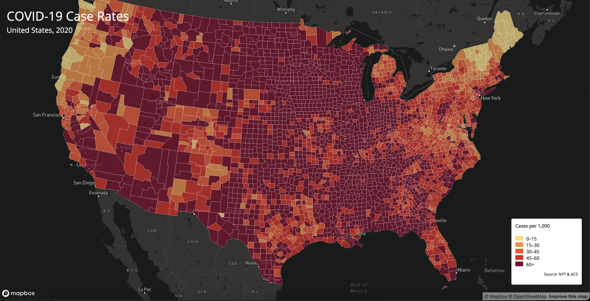
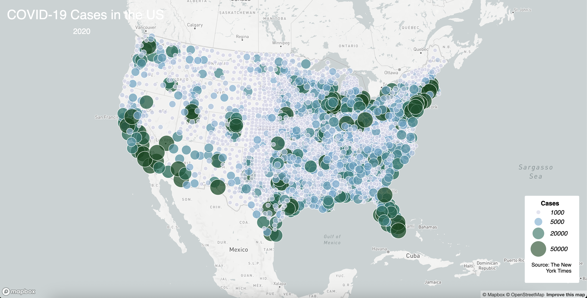

# Web Mapping Application 

## Project Overview
This project consists of two interactive web maps in which first map visualizes **COVID-19 cases and rates in the United States (2020)**, using both a **choropleth map** (for case rates per 1,000 residents) and a second map visualizes the **proportional symbol map** (for total case counts). The purpose of these maps is to demonstrate key web mapping techniques, including data-driven symbology, interactivity, legend creation, and proper map design for user readability. Using what we learned from the Japan Earthquakes example to design the choropleths and proportional symbol maps for this dataset.

---

## Live Map Links 
- **COVID-19 Choropleth Map (US, 2020):** [View Map](https://jishnuk123.github.io/Web-Map-Application/map1.html)  
- **COVID-19 Proportional Symbols Map (US, 2020):** [View Map](https://jishnuk123.github.io/Web-Map-Application/map2.html)  
---

## Screenshots
 ### COVID-19 Maps
  
  

---

## Primary Functions
The maps implement the following core functions:  

### Shared Functions
- **`loadGeoJSONData(source, layerId)`**: Loading GeoJSON data asynchronously and creates a map layer.  
- **`addMapLegend(grades, colors, radii)`**: Dynamically generates a legend based on the proportional symbol sizes and/or choropleth breaks.  
- **`createInteractivePopup(layer, properties)`**: Displays information (magnitude, cases, or rates) when a user clicks on a map feature.  

### COVID-19 Map – Special Feature
- **Choropleth Mapping with Albers Projection:** Maps the case rates at the county level using a sequential color scheme. The proportional symbol layer displays absolute case counts.  

---

## Libraries and Tools
- [Mapbox GL JS](https://docs.mapbox.com/mapbox-gl-js/guides/) – interactive map rendering  
- [Mapshaper](https://mapshaper.org/) – for simplifying and processing the shapefiles  
---

## Data Sources
- **COVID-19 Data:** The New York Times, 2020 ([NYT COVID-19 Dataset](https://github.com/nytimes/covid-19-data))  
- **Population Data:** U.S. Census Bureau, 2018 ACS 5-year estimates ([5 Year Estimate Data](https://data.census.gov/table/ACSDP5Y2018.DP05?g=0100000US$050000&d=ACS+5-Year+Estimates+Data+Profiles&hidePreview=true)) 
- **County Boundaries:** U.S. Census Bureau TIGER shapefiles([Shapefiles]https://www.census.gov/geographies/mapping-files/time-series/geo/carto-boundary-file.html)

---

## Resources
- Map visualization tutorials: [Mapbox GL JS Examples](https://docs.mapbox.com/mapbox-gl-js/example/)  
- Data preprocessing: using Mapshaper and USGS/NYT open data resources  

---

